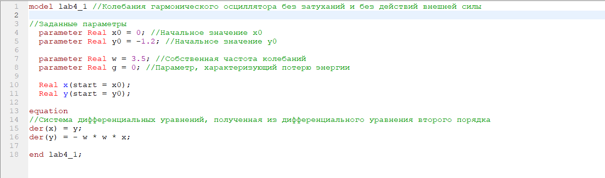
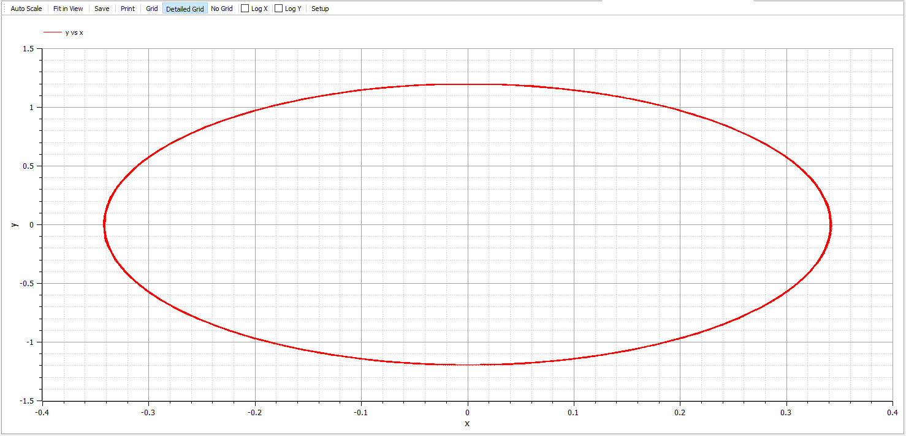
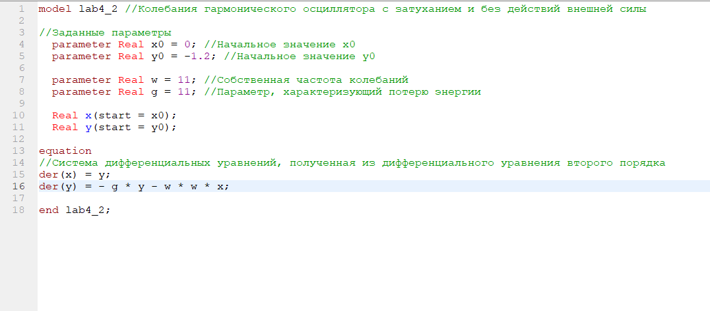
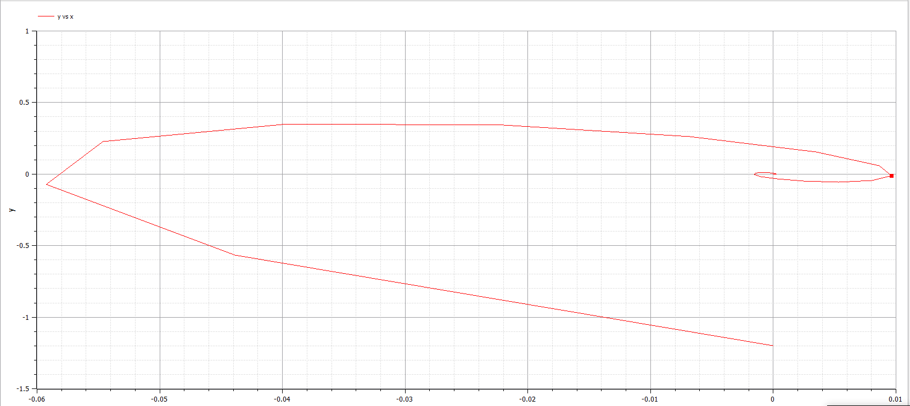
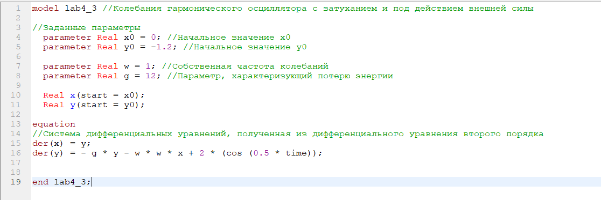
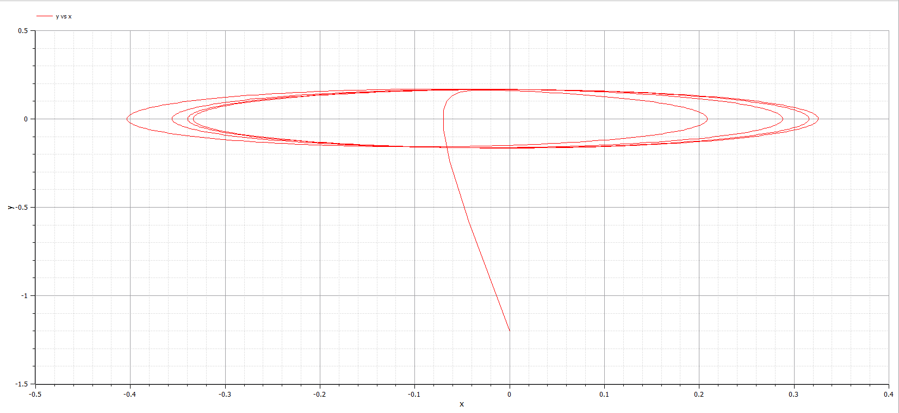

---
# Front matter
lang: ru-RU
title: "Лабораторная работа №4. Вариант 50"
subtitle: "Модель гармонических колебаний"
author: "Силкина Мария Александровна"

# Formatting
toc-title: "Содержание"
toc: true # Table of contents
toc_depth: 2
lof: true # List of figures
lot: true # List of tables
fontsize: 12pt
linestretch: 1.5
papersize: a4paper
documentclass: scrreprt
polyglossia-lang: russian
polyglossia-otherlangs: english
mainfont: PT Serif
romanfont: PT Serif
sansfont: PT Sans
monofont: PT Mono
mainfontoptions: Ligatures=TeX
romanfontoptions: Ligatures=TeX
sansfontoptions: Ligatures=TeX,Scale=MatchLowercase
monofontoptions: Scale=MatchLowercase
indent: true
pdf-engine: lualatex
header-includes:
  - \linepenalty=10 # the penalty added to the badness of each line within a paragraph (no associated penalty node) Increasing the value makes tex try to have fewer lines in the paragraph.
  - \interlinepenalty=0 # value of the penalty (node) added after each line of a paragraph.
  - \hyphenpenalty=50 # the penalty for line breaking at an automatically inserted hyphen
  - \exhyphenpenalty=50 # the penalty for line breaking at an explicit hyphen
  - \binoppenalty=700 # the penalty for breaking a line at a binary operator
  - \relpenalty=500 # the penalty for breaking a line at a relation
  - \clubpenalty=150 # extra penalty for breaking after first line of a paragraph
  - \widowpenalty=150 # extra penalty for breaking before last line of a paragraph
  - \displaywidowpenalty=50 # extra penalty for breaking before last line before a display math
  - \brokenpenalty=100 # extra penalty for page breaking after a hyphenated line
  - \predisplaypenalty=10000 # penalty for breaking before a display
  - \postdisplaypenalty=0 # penalty for breaking after a display
  - \floatingpenalty = 20000 # penalty for splitting an insertion (can only be split footnote in standard LaTeX)
  - \raggedbottom # or \flushbottom
  - \usepackage{float} # keep figures where there are in the text
  - \floatplacement{figure}{H} # keep figures where there are in the text
---

# Цель работы

Построить фазовый портрет гармонического осциллятора и решить уравнения гармонического осциллятора для следующих случаев:

1. Колебания гармонического осциллятора без затуханий и без действий внешней силы $\ddot {x} + 3.5x = 0$

2. Колебания гармонического осциллятора c затуханием и без действий внешней силы $\ddot {x} + 11 \dot {x} + 11x = 0$

3. Колебания гармонического осциллятора c затуханием и под действием внешней силы $\ddot {x} + 12 \dot {x} + 1x = 2cos(0.5t)$

На интервале $t \in [0; 51]$(шаг 0.05) с начальными условиями $x_0 = 0, y_0 = -1.2$

# Теоретическое введение

   Уравнение свободных колебаний гармонического осциллятора имеет следующий вид:

$$ \ddot {x} + 2 \gamma \dot {x} + \omega_0^2x = f(t) $$

$x$ — переменная

$t$ — время

$\omega_0$ — частота колебаний

$\gamma$ — параметр, характеризующий потери энергии

В свою очередь:

$$ \ddot{x} = \frac{\partial^2 x}{\partial t^2}, \dot{x} = \frac{\partial x}{\partial t}$$

# Выполнение лабораторной работы

Я выполняла данную лабораторную работу на языке modelica. Мною был написан программный код для первого случая: колебания гармонического осциллятора без затуханий и без действий внешней силы (рис. -@fig:001)

{ #fig:001 width=70% }

При запуске данного кода был выведен график (рис. -@fig:002)

{ #fig:002 width=70% }

Далее был написан код для второго случая: колебания гармонического осциллятора c затуханием и без действий внешней силы  (рис. -@fig:003)

{ #fig:003 width=70% }

Был выведен график (рис. -@fig:004)

{ #fig:004 width=70% }

Для третьего случая: колебания гармонического осциллятора c затуханием и под действием внешней силы был написан следующий код (рис. -@fig:005)

{ #fig:005 width=70% }

График для данного случая выглядит следующим образом (рис. -@fig:006)

{ #fig:006 width=70% }

# Ответы на вопросы

## Запишите простейшую модель гармонических колебаний

Простейшим видом колебательного процесса являются простые гармонические колебания, которые описываются уравнением $x = x_m cos (\omega * t + \phi_0)$, где

$x$ — смещение тела от положения равновесия

$x_m$ — амплитуда колебаний

$\omega$ — циклическая или круговая частота

$\phi_0$ — начальная фаза гармонического процесса

## Дайте определение осциллятора
Осциллятор — система, тело, частица, совершающие периодические колебания вокруг положения устойчивого равновесия, показатели которой периодически повторяются во времени.

## Запишите модель математического маятника

В случае малых колебаний, когда полагают $sin{\alpha} ≈ \alpha$ возникает линейное дифференциальное уравнение $$\frac{d^2 \alpha}{d t^2} + \omega^2 \alpha = 0$$

## Запишите алгоритм перехода от дифференциального уравнения второго порядка к двум дифференциальным уравнениям первого порядка

Нам дано ДУ 2-го порядка:
$$ \ddot {x} + w_0^2x = f(t) $$

Для перехода к системе уравнений первого порядка сделаем замену по методу Рунге - Кутта:
$$ y = \dot{x} $$

После данной замены мы получим систему дифференциальных уравнений следующего вида:
    $$ \begin{cases} y = \dot{x} \\ \dot{y} = - w_0^2x \end{cases}$$
    
## Что такое фазовый портрет и фазовая траектория?
Фазовый портрет — графическое изображение системы на фазовой плоскости (или в многомерном пространстве), по координатным осям которого отложены значения величин переменных системы. Поведение переменных во времени при таком способе представления для каждой начальной точки описывается фазовой траекторией. Совокупность таким фазовых траекторий для любых начальных условий представляет собой фазовый портрет.

Фазовая траектория — кривая в фазовом пространстве, составленная из точек, представляющих состояние динамической системы в последовательные моменты времени в течение всего времени эволюции.

# Выводы

При выполнении данной лабораторной работы я познакомилась с моделью гармонических коллебаний, научилась выводить ДУ, а также построила фазовый портрет гармонического осциллятора, решила уравнения гармонического осциллятора:

1. Колебания гармонического осциллятора без затуханий и без действий внешней силы.

2. Колебания гармонического осциллятора c затуханием и без действий внешней силы.

3. Колебания гармонического осциллятора c затуханием и под действием внешней силы.